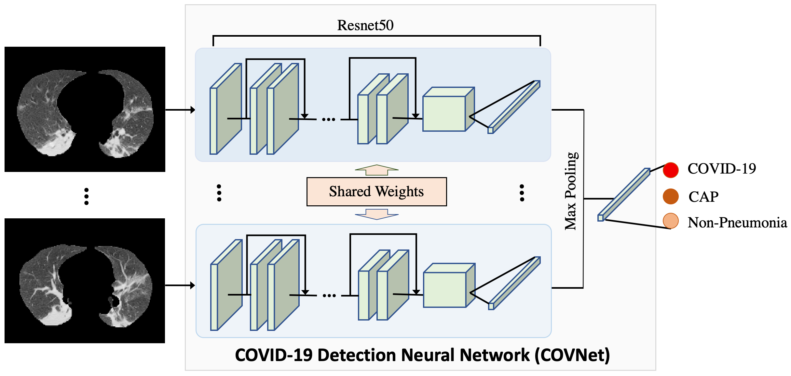
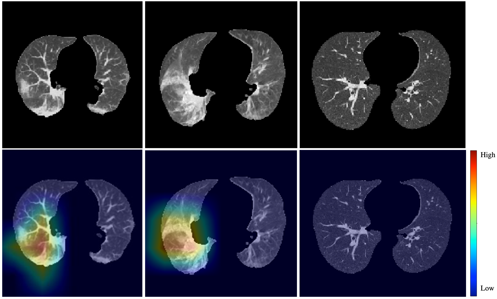

# COVID-19 Detection Neural Network (COVNet)
This is a PyTorch implementation of the paper "[Artificial Intelligence Distinguishes COVID-19 from Community Acquired Pneumonia on Chest CT](https://pubs.rsna.org/doi/10.1148/radiol.2020200905)". It supports training, validation and testing for COVNet.



### Updates & Notices
- 2020-03-30: Thanks for the interest in our work. Unfortunately, we do not own the data, and we have to get permission from our collaborators before we share the data and model. We will update later.

## Citation
If you find this code is useful for your research, please consider citing:
```
@article{li2020artificial,
  title={Artificial Intelligence Distinguishes COVID-19 from Community Acquired Pneumonia on Chest CT},
  author={Li, Lin and Qin, Lixin and Xu, Zeguo and Yin, Youbing and Wang, Xin and Kong, Bin and Bai, Junjie and Lu, Yi and Fang, Zhenghan and Song, Qi and Cao, Kunlin and others},
  journal={Radiology},
  year={2020}
}
```

## Setup
### Prerequisites
- Anaconda 3.7
- PyTorch 1.4
- SimpleITK
- batchgenerators
- tensorboardX

### Prepare data
Preprocess the data according to the [Appendix E1 section](https://pubs.rsna.org/doi/suppl/10.1148/radiol.2020200905/suppl_file/ry_200905_supp_in%20press.pdf) of the paper and organize them as the following. A example of train.csv and val.csv are also provided.
```
data
├── caseid1
|   ├── masked_ct.nii
|   └── mask.nii.gz
├── caseid2
|   ├── masked_ct.nii
|   └── mask.nii.gz
├── caseid3
|   ├── masked_ct.nii
|   └── mask.nii.gz
├── caseid4
|   ├── masked_ct.nii
|   └── mask.nii.gz
├── train.csv
└── val.csv
```

## COVNet


### Training
Training a COVNet with default arguments. Model checkpoints and tensorboard logs are written out to a unique directory created by default within `experiments/models` and `experiments/logs` respectively after starting training.
```
python main.py
```

### Validation and Testing
You can run validation and testing on the checkpointed best model by:
```
python test.py
```
